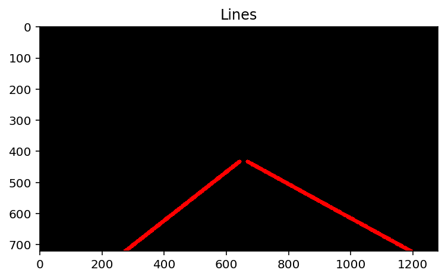

# **Finding Lane Lines on the Road** 

**Finding Lane Lines on the Road**

The goals / steps of this project are the following:
* Make a pipeline that finds lane lines on the road
* Reflect on your work in a written report

### Reflection

Interesting project.

### 1. Describe your pipeline. As part of the description, explain how you modified the draw_lines() function.

My pipeline consisted of 6 steps:

* Color Filter to isolate white and yellow features in the image.  I tried both RBG and HSL color spaces. The HSL color space was slightly more effective.
* Conversion to Gray scale
* Gaussian Blur - after experimenting, I settled on a kernel size of 9
* Canny edge detection 
* Region of interesting isolation.
* Hough line fnding

The draw lines function was modified to sort the lines into left and right lane buckets based on slope.
Any lines that were near horizontal were assumed to be noise and were rejected.  After calculating slope, 
y-intercept, and length for the right and left lines, they were weighted by length and averged.  The average 
line for each lane was then on the image starting at the bottom of the image to the 60% point of the frame.  

### Original Image

### OHSL White/Yellow Mask

### Color Masked Image

### Grayscale Image

### Gaussian Image

### Canny Edge Detection

### Hough Line Finding

### Final Image

### 2. Identify potential shortcomings with your current pipeline

The current pipleline can easily get confused by changes of color, or shadows.  For example the shadow
the tree accross the road in the challenge video causes the yellow line line to break up, and also causes spurious
lines to be detected in the roadway.

The is a certain amount of jitter from frame to frame.

The pipeline does not deal well with missing data.

The linear line fitting does not really account for curved roads.  The sharper the turn, the less well it does.

Perspective not really accounted for if the camera moves, or if the road is sloped steeply, the pipeline might
not find the lanes correctly.

### 3. Suggest possible improvements to your pipeline

Some of the improvements that coud be made:

- Better isolation of features using color and statistical filtering.  For example, filter on multiple narrow bands instead of just white and yellow and identify and discard outliers.
- Handle missing data, for example when a lane marker disappears for a few frames
- Reduce jitter by smoothing data between frames
- Fit curved lane lines instead of just linear
